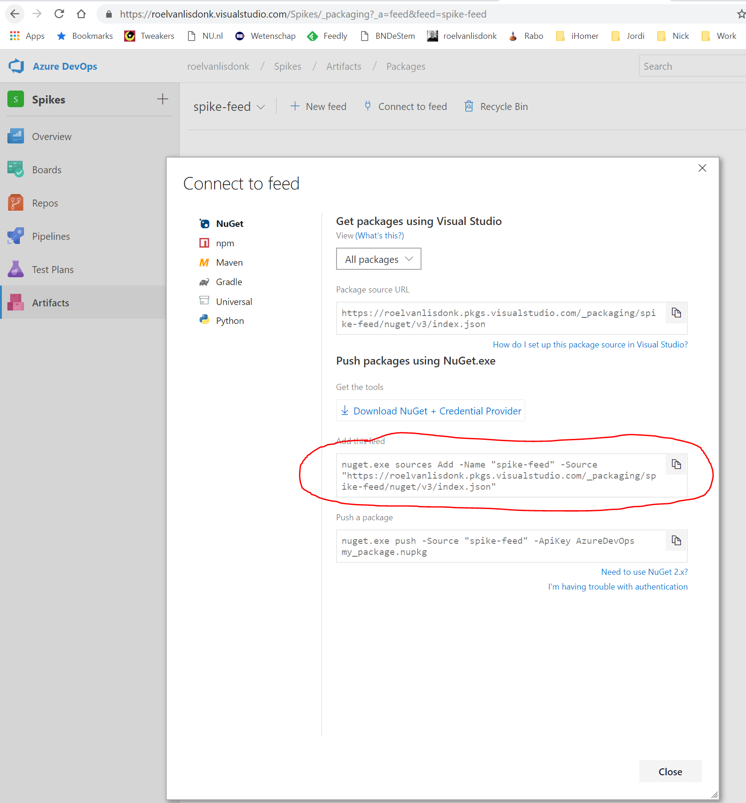

If you want to use NuGet or npm packages from an Azure DevOps pipeline in Visual Studio Code, you can following these steps:


# Prerequisites
You must first install the "Microsoft Azure Artifacts Credential Provider".

https://github.com/Microsoft/artifacts-credprovider


On a Windows machine I installed it by:
- creating a file:  C:\Temp\installcredprovider.ps1".
- copying the code from "https://raw.githubusercontent.com/Microsoft/artifacts-credprovider/master/helpers/installcredprovider.ps1" to it
- executed the file in a PowerShell prompt:

```PowerShell
Set-Location "C:\Temp"
.\installcredprovider.ps1
```

# Project

## Add the feed to NuGet configuration
Add feed to your NuGet configuration by executing:

nuget.exe sources Add -Name "spike-feed" -Source "https://roelvanlisdonk.pkgs.visualstudio.com/_packaging/spike-feed/nuget/v3/index.json"

NOTE: use the exact line as found under > Artifacts > Connect to feed button:
In mine case: nuget.exe sources Add -Name "spike-feed" -Source "https://roelvanlisdonk.pkgs.visualstudio.com/_packaging/spike-feed/nuget/v3/index.json"

The name should really be the name of the feed, not some custom name.




## Run dotnet restore once with --interactive to authenticate against the Azure DevOps feed
We have to execute dotnet restore with --interactive once, to authenticate against the Azure DevOps feed.

```PowerShell
dotnet restore --interactive
```

After that you can use dotnet restore without manual authentication.

Now if you open the .NET Core solution in Visual Studio it will also work and you don't have to do anything.


